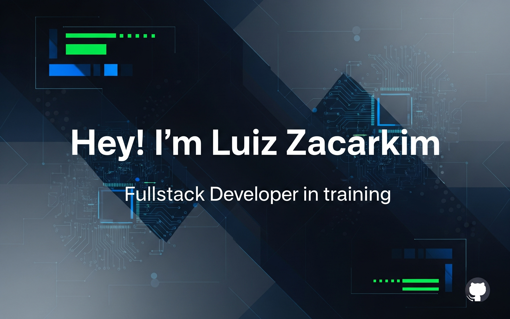

 

🎯 Fullstack Developer in training | 💻 Student of Systems Analysis and Development at [PUC Minas](https://www.pucminas.br/)  

---

## 📬 Let's Connect  

## ✨ About Me  
I'm passionate about **technology** and actively building my career as a **Full-Stack Developer**.  

🔹 Strong foundation in **programming logic** and **software development**  
🔹 Focused on **Front-end** (HTML, CSS, JavaScript) and **Back-end** (C#, .NET)  
🔹 Skills in **problem-solving**, **process management**, and following **complex procedures**  
🔹 Excited to contribute across the **full software development lifecycle**  

## 👨‍💻 Competitive Programming  

To sharpen my logic and problem-solving, I practice on:  
**Codewars**, **HackerRank**, and **LeetCode**  

### 🏆 Coding Profiles  

## ⚙️ GitHub Analytics  

  

## 📂 Projects  

- [**Imobiflow - Gestão de Leads e Imóveis**](https://github.com/lfzacarkims/imobiflow-gestao-leads-imoveis)  
- [**Alura: Front-end - Portfólio**](https://github.com/lfzacarkims/alura-front-end-portfolio)  

## 💼 Professional Experience  

**Electrician Distribution Networks I – CPFL Paulista**  
*Aug 2023 – Present*  
- Diagnosed and solved failures in complex systems using logical reasoning.  
- Executed tasks with strict compliance to technical and safety standards.  
- Managed processes to optimize energy efficiency and resource usage.  

## 🎓 Academic Background  

**Systems Analysis and Development**  
📍 PUC Minas | *Feb 2025 – Jun 2027 (Expected)*  

**Electrotechnical Technician**  
📍 FASPEC | *Oct 2023 – Apr 2025 (Completed)*  

## 🔧 Tools  

## 💻 Languages  

## 🗃 Frameworks  

## 📚 Libraries & Databases  

## 🌟 Additional Highlights  

- Passionate about **continuous learning** and **emerging technologies**  
- Strong **collaborative mindset** and problem-solving attitude  
- Fluent in **Portuguese** | Currently learning **English**  

---
